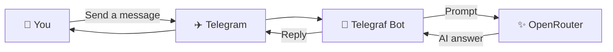

<div align="center">


# 🤖 Telegram GPT Bot

**A tiny AI friend that lives in your Telegram chats.**

[](https://www.typescriptlang.org/)
[](https://nodejs.org/)
[](https://telegram.org/)
[](https://openrouter.ai/)

Send a message → let AI think → get an answer. ✨

</div>

---

## ✨ What can it do?

| | Feature |
| :---: | --- |
| 💬 | Replies to Telegram messages with AI-generated answers |
| 🆓 | Uses OpenRouter's free model router (`openrouter/free`) |
| ⌨️ | Shows a typing indicator while preparing a response |
| 🛟 | Handles empty responses and API errors gracefully |
| 🔐 | Keeps credentials in environment variables |
| 💙 | Uses strict TypeScript for safer code |

## 🧰 Built with

- Node.js
- TypeScript
- Telegraf
- OpenAI JavaScript SDK
- OpenRouter API

## 🎒 Before you begin

Before starting, you need:

- A recent [Node.js](https://nodejs.org/) installation
- A Telegram bot token from [@BotFather](https://t.me/BotFather)
- An [OpenRouter API key](https://openrouter.ai/keys)

## 🚀 Quick start

1. Clone the repository:

   ```bash
   git clone https://github.com/ardalan-shahandeh/telegram-gpt-bot.git
   cd telegram-gpt-bot
   ```

2. Install the dependencies:

   ```bash
   npm install
   ```

3. Create a `.env` file in the project root:

   ```env
   TELEGRAM_BOT_TOKEN=your_telegram_bot_token
   OPENROUTER_API_KEY=your_openrouter_api_key
   ```

4. Start the bot:

   ```bash
   npm exec tsx src/index.ts
   ```

5. Open your bot in Telegram, send `/start`, and begin chatting. 🎉

> [!TIP]
> Keep the terminal open while chatting—the bot runs from that process.

## 🎮 Commands

| Command | Description |
| --- | --- |
| `npm install` | Install project dependencies |
| `npm exec tsx src/index.ts` | Run the bot locally |
| `npm exec tsc -- --noEmit` | Type-check the project |
| `npm exec tsc` | Compile TypeScript into `dist/` |

## 🪄 How the magic works



1. Telegraf receives a text message from Telegram.
2. The bot sends the message to OpenRouter through the OpenAI-compatible API.
3. OpenRouter selects an available free model.
4. The generated answer is sent back to the Telegram chat.

## 🗂️ Project map

```text
telegram-gpt-bot/
├── assets/
│   └── banner.svg     # Colorful README artwork
├── src/
│   └── index.ts       # Bot setup and message handling
├── .gitignore
├── package.json
├── package-lock.json
├── tsconfig.json
└── README.md
```

## 🔑 Configuration

| Variable | Required | Description |
| --- | --- | --- |
| `TELEGRAM_BOT_TOKEN` | Yes | Token generated by Telegram's BotFather |
| `OPENROUTER_API_KEY` | Yes | API key used to access OpenRouter |

> [!CAUTION]
> The `.env` file is ignored by Git. Never commit tokens or API keys. If a credential is exposed, revoke it immediately and generate a replacement.

## 🎨 Make it yours

To use a specific OpenRouter model, change the `model` value in `src/index.ts`. Available model identifiers are listed in the [OpenRouter model catalog](https://openrouter.ai/models).

You can also customize the welcome and error messages in `src/index.ts`.

## 🧯 Troubleshooting

- **The bot does not respond:** confirm the process is running and `TELEGRAM_BOT_TOKEN` is correct.
- **AI requests fail:** verify `OPENROUTER_API_KEY` and check your OpenRouter account status.
- **The bot exits during startup:** reinstall dependencies with `npm install` and run the type checker.
- **Messages are delayed:** free model availability and response time can vary.

## 🤝 Contributing

Contributions are welcome. Fork the repository, create a feature branch, make your changes, and open a pull request.

## 📜 License

This project is distributed under the ISC license, as declared in `package.json`.
